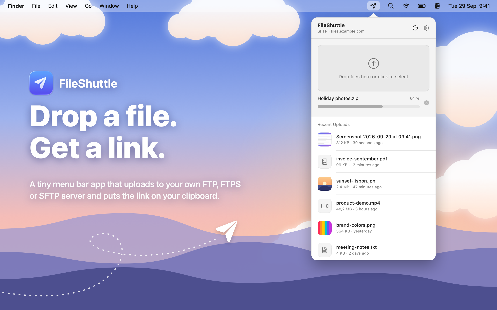

# FileShuttle



FileShuttle is a simple macOS menubar app for uploading files to your own server over FTP, FTPS or SFTP. Drop a file, get a link.

A modern rewrite of the original [FileShuttle](https://github.com/FileShuttle/fileshuttle), with a design inspired by [BucketDrop](https://github.com/fayazara/bucketdrop).

## Features

- Drag & drop files onto the menubar icon to upload instantly
- Click to select files from Finder
- URLs automatically copied to clipboard
- Upload progress right in the menubar icon
- Recent uploads with thumbnails
- Upload the clipboard with a shortcut (⌥⌘U)
- Auto-upload new screenshots
- Works with FTP, FTPS and SFTP (password or SSH key)

## Installation

1. Download the latest `.dmg` from [Releases](https://github.com/elalemanyo/fileshuttle/releases)
2. Move `FileShuttle.app` to your Applications folder
3. Open the app - it will appear in your menubar

The app isn't notarized by Apple, so macOS blocks the first launch. Open **System Settings → Privacy & Security** and click **Open Anyway** (only once).

Or remove the quarantine flag in Terminal:

```sh
xattr -dr com.apple.quarantine /Applications/FileShuttle.app
```

FileShuttle keeps itself up to date with [Sparkle](https://sparkle-project.org). You can also use **Check for Updates…** in the ••• menu.

## Setup

1. Click the FileShuttle icon in the menubar
2. Click the gear icon to open Settings
3. Enter your server details:
   - **Protocol** (FTP, FTPS or SFTP)
   - **Host** and **Port**
   - **Username** and **Password** (or SSH key for SFTP)
   - **Remote folder** - Where files are uploaded on the server
   - **Public URL** - The web address that serves that folder
4. Click "Test Connection" to verify

## Usage

- **Drag & drop** files onto the menubar icon or the popover to upload
- **Click** the drop zone to select files from Finder
- **Click** a file in the list to copy its URL again
- **Right-click** a file for more actions (open, show in Finder, delete from server)

Uploaded file URLs are automatically copied to your clipboard.

## Requirements

- macOS 15.0 (Sequoia) or later

## Contributing

Ideas, bug reports and pull requests are all welcome. If something doesn't work with your server or you'd love a new feature, [open an issue](https://github.com/elalemanyo/fileshuttle/issues) and let's talk about it.

To run it locally you need Xcode 26 and [XcodeGen](https://github.com/yonaskolb/XcodeGen):

```sh
brew install xcodegen
xcodegen generate
open FileShuttle.xcodeproj   # then press ⌘R
```

A quick map of the code:

- `App/` - the menubar app (status icon, popover, settings)
- `Packages/ShuttleKit/` - the upload engine (FTP/FTPS via libcurl, SFTP via [Citadel](https://github.com/orlandos-nl/Citadel))
- `scripts/` - helpers to build the DMG, render the preview image and start test servers

Tests live in the upload engine: run `swift test` inside `Packages/ShuttleKit`. Want to try real uploads? `scripts/test-servers.sh` starts local FTP and SFTP servers in Docker, then run `SHUTTLE_INTEGRATION=1 swift test`.

### Releasing

Push a tag and GitHub Actions does the rest:

```sh
git tag v0.2.0 && git push origin v0.2.0
```

The workflow builds a universal DMG (`scripts/make-dmg.sh`), signs it for Sparkle and writes `appcast.xml` (`scripts/make-appcast.sh`), then publishes both on the GitHub release. Installed apps find the update through `releases/latest/download/appcast.xml`. Tags with a `-` (like `v0.2.0-beta.1`) become pre-releases, which installed apps ignore.

Updates are signed with a Sparkle EdDSA key: the public key is `SPARKLE_PUBLIC_KEY` in `project.yml` (Release builds only, so Debug builds from Xcode never check for updates), the private key is the `SPARKLE_PRIVATE_KEY` repository secret.

Not sure where to start? Small things help too: trying it with your hosting provider, improving the docs, or sharing how you use it.

## License

[MIT](LICENSE)
